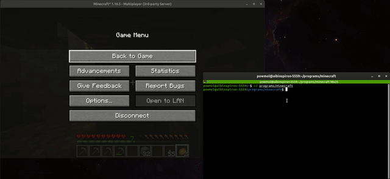

# Minecraft Autodigger

Scripts for automatic mouse moving and keystrokes to play Minecraft automatically and to save some time.

## Requirements

- [xdotool](https://manpages.ubuntu.com/manpages/trusty/man1/xdotool.1.html)
- Bash
- Python 3

## Installation

1. Install *xdotool*. Depending on your package manager, run:
```bash
$ sudo apt install xdotool
$ sudo yum install xdotool
$ sudo dnf install xdotool
$ sudo pacman -S xdotool
```

2. If you want to use bash script, run `bash 2dig-forward.bash`. If you want to use more sophisticated python script, run `python3 3dig-chunk.py`. Do not run the script as a background process. Then switch into Minecraft.

3. If you want to terminate the script runnning, jump quickly to the terminal, form where is the script run and send SIGINT (CTRL + C).

## Scripts

`1forward.bash` - runs forward with pressed `w`

`2dig-forward.bash` - digs 2 blocks height forward just to fit the player, until pickaxe is depleted. Additionally, it puts a torch on the wall, after `place_torch_after` count of block pairs is dag with a particular pickaxe. You may want to set `pickaxe_slots` and `pickaxe_durability` at the beginning of the script.



`3dig-chunk.py` - by default, it digs 16x16x3 blocks (chunk). It requires to have around 7 stone pickaxes, 16 torches and at least two blocks, which can player dig for block synchronization. The default `dig_duration` value is optimized just enough to dig any single block with stone pickaxe. However, for this script, falling gravel blocks make mess.

```
#    0 1 2 3 4 5 6 7 8 9101112131415 
#  0 . . . . . . . . . . . . . . . .
#  1 . t . . . t . . . t . . . t . .
#  2 . . . . . . . . . . . . . . . .
#  3 . . . . . . . . . . . . . . . .
#  4 . . . . . . . . . . . . . . . .
#  5 . t . . . t . . . t . . . t . .
#  6 . . . . . . . . . . . . . . . .
#  7 . . . . . . . . . . . . . . . .
#  8 . . . . . . . . . . . . . . . .
#  9 . t . . . t . . . t . . . t . .
# 10 . . . . . . . . . . . . . . . .
# 11 . . . . . . . . . . . . . . . .
# 12 . . . . . . . . . . . . . . . .
# 13 . t . . . t . . . t . . . t . .
# 14 . . . . . . . . . . . . . . . .
# 15 . . . . . . . . . . . . . . . .
#    ^
#  start
```

## Recommendations

- The scripts do not take in account, what is happening inside Minecraft. Do not take anything valuable, while executing scripts and not watching, what they are doing.
- Look at the beginning of the scripts. Feel free to modify initial constants. Values are tuned for **Stone Pickaxe**.
- It is possible, mouse relative movement will not work for your setting. It is tested only in my setting. If automatic mouse moves too much or not enough is only possible to fix it with manuall inspection of the code and tuning the proper values.
